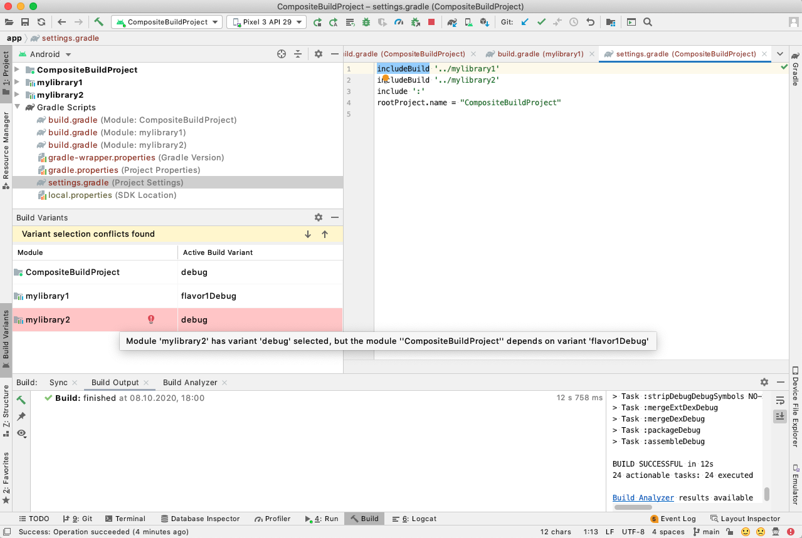

# Composite Build Flavor Test App

## Goal

Demonstrate an issue with product flavor resolution in Android Studio when using the Gradle composite build.

## Prerequisites

Android Studio 4.1 RC 3 (also reproducible in 4.2 Canary 13).

## Description

IDE displays the `Variant selection conflicts found` error in the Build Variants view, when the app module depends on multiple library modules added to the build through the `includeBuild()` instruction in `settings.gradle` ([Gradle composite build](https://docs.gradle.org/current/userguide/composite_builds.html)) and those modules have different product flavor setup.

## Steps

1. Clone this GitHub project.
2. Open the `CompositeBuildProject/app` project in Android Studio.
3. Wait until Gradle sync and index building are finished.
4. Open `View -> Tool Windows -> Build Variants`
5. Android Studio should display the variant selection conflict error at this point
6. *Optional*: Verify that the build still completes without errors and the app starts on emulator/device.
7. *Optional*: Verify that after switching `CompositeBuildProject` to `release`, the app cannot be started.

## Project Structure

The test project consists of three Android modules as described below.

## App Module

This module resides in `CompositeBuildProject/app` and doesn't have any product flavors or flavor dimensions defined.

It depends on two libraries: `mylibrary1` and `mylibrary2` (added externally using `includeBuild()` in `settings.gradle`).

The app module provides a missing dimension strategy for `mylibrary1`:
```gradle
missingDimensionStrategy 'dim1', 'flavor1'
```

### MyLibrary1

First library module, located in `CompositeBuildProject/mylibrary1`.

It has the following flavor setup:
```gradle
flavorDimensions 'dim1'

productFlavors {
    flavor1 {
        dimension 'dim1'
    }
    flavor2 {
        dimension 'dim1'
    }
}
```

### MyLibrary2

Second library module, located in `CompositeBuildProject/mylibrary2`.

This library doesn't have any product flavors or flavor dimensions defined.

## Compiling

Note that compiling and assemling the app still works fine from the command line:
```sh
cd CompositeBuildProject/app
./gradlew assemble
```

## Traditional Multi-Module Project

This repository also contains a version of the same project using a traditional multi-module structure, located in the `MultiModuleProject` directory.

Follow these steps to confirm that the issue is not reproduced with the traditionally structured project:

1. Open the `MultiModuleProject` project in Android Studio.
2. Wait until Gradle sync and index building are finished.
3. Open `View -> Tool Windows -> Build Variants`
4. Try switching between `debug` and `release` flavors for `MultiModuleProject.app` and confirm there are not conflicts displayed by the IDE.
5. *Optional*: Verify that the build still completes without errors and the app starts on emulator/device.

## Screenshot


